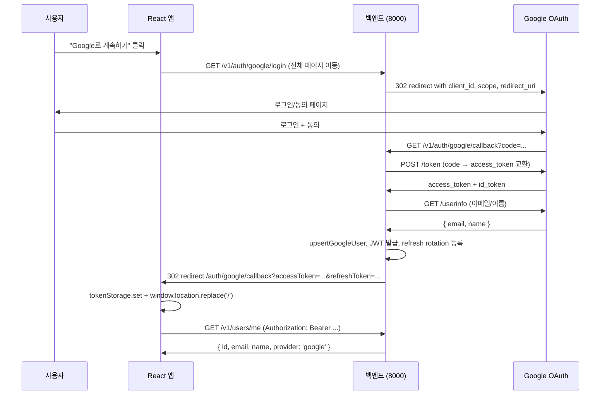

# Week 5 — Mission 3: Google Social Login

UMC 10th DAU Web · 5주차 미션 3 — **OAuth 2.0 Authorization Code Flow로 Google 로그인 구현**

## 미션 요약

- 사용자가 "Google로 계속하기" 클릭 → 백엔드 `/v1/auth/google/login`으로 리다이렉트
- 백엔드가 Google OAuth 페이지로 리다이렉트 (client_id, scope 등 포함)
- Google에서 인증·동의 → 백엔드 `/v1/auth/google/callback`으로 code 전달
- 백엔드가 code → access_token 교환 → 사용자 정보 조회 → DB upsert → **자체 JWT 발급**
- 프론트의 `/auth/google/callback`으로 토큰을 query string에 담아 리다이렉트
- 프론트가 토큰을 localStorage에 저장 → 메인 진입

## 폴더 구조

```
mission3/
├── api/
│   ├── axios.js
│   ├── auth.js
│   └── google.js              ← 백엔드 OAuth 시작점으로 리다이렉트
├── auth/
│   ├── AuthContext.jsx
│   └── tokenStorage.js
├── pages/
│   ├── Home.jsx
│   ├── Login.jsx              ← Google 버튼 + 이메일 폼
│   ├── PremiumWebtoon.jsx
│   └── GoogleCallback.jsx     ← 토큰 추출 → 저장 → 메인 이동
├── App.css
├── App.jsx                    ← /auth/google/callback 라우트 추가
├── ProtectedRoute.jsx
├── index.css
├── main.jsx
└── backend/                   ← Mission 2 stub과 동일 (확장됨)
    ├── server.js
    ├── routes/
    │   ├── auth.js            ← /google/login, /google/callback 추가
    │   └── users.js
    ├── jwt.js, store.js, middleware.js
    └── .env
```

## OAuth 흐름 시퀀스



## Google Client ID 발급

1. [Google Cloud Console](https://console.cloud.google.com/) 접속
2. 새 프로젝트 생성 (필요 시 결제 카드 등록 — 무료 사용량 안에서 비용 X)
3. **API 및 서비스 → OAuth 동의 화면**: 외부 / 앱 이름 / 이메일 입력
4. **사용자 인증 정보 → OAuth 2.0 클라이언트 ID 만들기**
   - 애플리케이션 유형: 웹 애플리케이션
   - **승인된 자바스크립트 출처**: `http://localhost:5173`
   - **승인된 리디렉션 URI**: `http://localhost:8000/v1/auth/google/callback`
5. 발급받은 Client ID / Client Secret을 `backend/.env`에 입력

```env
GOOGLE_CLIENT_ID=발급받은_ID
GOOGLE_CLIENT_SECRET=발급받은_SECRET
GOOGLE_CALLBACK_URL=http://localhost:8000/v1/auth/google/callback
```

## 실행

```bash
# 1) 백엔드
cd backend
npm install
npm run dev    # localhost:8000

# 2) 프론트 (다른 터미널)
cd ..
npm install
npm run dev    # localhost:5173
```

## 동작 검증

1. `/login` 진입
2. "Google로 계속하기" 버튼 클릭
3. Google 로그인 페이지에서 본인 계정으로 로그인 + 동의
4. 자동으로 `/auth/google/callback?accessToken=...` → 메인 페이지로 이동
5. `/premium/webtoon/1` 접근 — 인증된 상태로 정상 진입

## 체크리스트

- [x] Google API Console 설정 가이드 README에 정리
- [x] Client ID·Redirect URI를 `.env`로 분리 (커밋 X)
- [x] 프론트는 `window.location.href`로 백엔드의 OAuth 시작점에 풀 리다이렉트
  - 팝업이나 직접 Google API 호출 X (백엔드가 client_secret을 안전하게 보관)
- [x] 콜백 페이지에서 query string의 토큰을 추출해 저장
- [x] 이전 미션의 Refresh Token interceptor 그대로 적용 → Google 로그인 후에도 자동 갱신 동작
